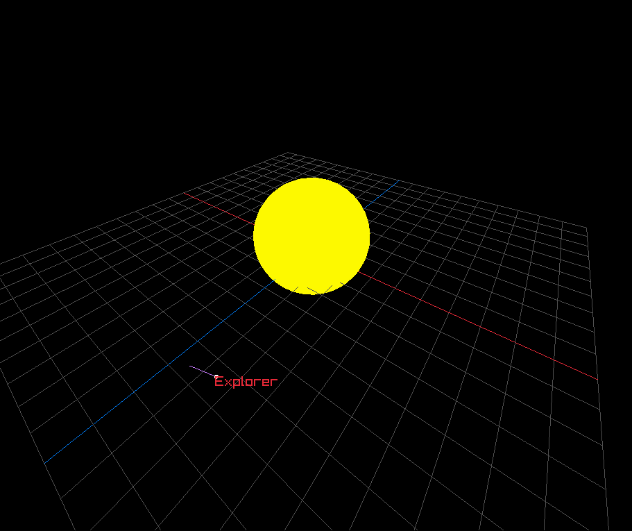

# DimOrbit
_DimOrbit_ is a Newtonian spacecraft/orbit simulator based on my Raylib wrapper/game engine [_DimEngineZ_](https://www.github.com/Mher-DeLight/DimEngineZ). It is meant to be simple and easy-to-use.

> [!WARNING]
> Some changes are made to _DimEngineZ_ directly from _DimOrbit_ without modifying the original copy. This may include bug fixes that may not be mirrored immediately to _DimEngineZ_.

---

## Videos & Images
### Images


### Demonstration Videos
* [Demonstration Video #1](https://www.youtube.com/watch?v=Z1Se9Q21jNo)
* [Demonstration Video #2](https://www.youtube.com/watch?v=9sX14I9Tfn8)

---

## Example
Here's an example of the sun, an XZ Clue plane, and a spacecraft called "Explorer" that orbits around it.
```cpp
#include <DimOrbit/DimOrbit.h>

int main(int, char**) {
    // aliases
    namespace dez = DimEngineZ;
    namespace dor = DimOrbit;
    using Vec3 = DimEngineZ::Vec3;

    // initialization
    dez::manager::init(1000, 800, "Mission Simulation");

    auto camera = dez::Camera(Vec3{3.0, 3.0, 3.0}, dez::CameraOptions{
                                                       .fovy = 110.0,
                                                   });
    camera.setTarget(Vec3::ZERO);

    auto system = dor::CelestialSystem();

    auto renderer = dor::Renderer();
    renderer.enableXZClue(true);
    renderer.xzclue.height = 0.0f;

    auto clock = dor::Clock(system);

    auto controller = dor::Controller();
    controller.bindVec3(
        "move", KEY_SPACE, KEY_LEFT_SHIFT, KEY_A, KEY_D, KEY_W,
        KEY_S); // forward and backward are inverted because of look-around weirdness
    controller.bindVec2("look", KEY_T, KEY_G, KEY_F, KEY_H);
    controller.bindVec3("thrust", KEY_RIGHT_SHIFT, KEY_KP_1, KEY_LEFT, KEY_RIGHT, KEY_DOWN, KEY_UP);

    // bodies
    auto earth = system.addBody(dor::BodyOptions{
        .name = "Earth",
        .radius = 1.0,
        .color = GREEN,
        .mass = 1.0,
        .collide = false,
    });
    auto spacecraft = system.addSpacecraft(dor::BasicSpacecraftOptions{
        .name = "Spacecraft",
        .radius = 0.1,
        .color = RED,
        .mass = 1e-9,
        .collide = false,
        .specificImpulse = 1e-9,
    });
    spacecraft->engine.start(spacecraft->physics->core.mass); // sets throttle
                                                              // scales down thrust to be appropriate to the mass
    spacecraft->body->beginCircularOrbit(*earth.get(), 3.0, PI);

    // constants
    constexpr float CAM_SPEED = 3.0f;
    constexpr float CAM_LOOK_SPEED = 1.75f;
    constexpr float THRUST_MULTIPLIER = 2.0f;

    // main loop
    int exit_code = dez::manager::fixedloop(
        60, 60,

        // physics
        [&](float delta) {
            Vec3 movVec = controller.getVec3("move") * delta * CAM_SPEED;
            camera.moveForward(movVec.z);
            camera.moveRight(movVec.x);
            camera.moveUp(movVec.y);

            dez::Vec2 lookVec = controller.getVec2("look") * CAM_LOOK_SPEED;
            camera.lookAround(-lookVec.x * delta, lookVec.y * delta);

            Vec3 thrust = controller.getVec3("thrust") * THRUST_MULTIPLIER;
            spacecraft->engine.setMaxThrust(thrust);

            clock.tick(delta);
            return true;
        },

        // rendering
        [&]() {
            renderer.doindraw(BLACK, [&]() {
                renderer.doin3d(camera, [&]() {
                    // render the system in 3d mode
                    renderer.render(system);
                    renderer.displayVector(spacecraft->physics->core.velocity,
                                           spacecraft->physics->transform.position, YELLOW);
                    renderer.displayVector(spacecraft->engine.maxThrust,
                                           spacecraft->physics->transform.position, RED);
                    return 0;
                });

                renderer.renderName(*spacecraft.get(), GREEN);
                renderer.draw2DLabel(clock.time.getUTCTime(), dez::Vec2::ZERO);
                return 0;
            });
            return true;
        });

    return exit_code;
}
```
As you can see, there is a strong separation between the actual physics (`dor::CelestialSystem`) and other aspects of the simulation (`dor::Renderer`, `dor::Clock`, `dor::Controller`). Things such as labels, vectors, and drawing in general are handled exclusively by the Renderer.